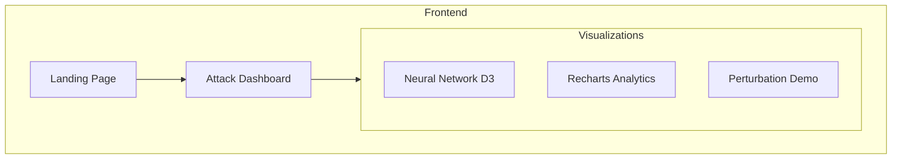

# AdversarialX

Interactive adversarial machine learning attack simulation platform. Visualize neural network vulnerabilities, perturbation effects, and defense mechanisms in real-time.


## Live Demo

🔗 **[View Live Demo](https://adversarial-x.vercel.app/)**

## Features

### Neural Network Visualization
- Interactive layer-by-layer network visualization
- Real-time node activation during attacks
- Connection weight perturbation display

### Attack Simulation
- **FGSM** - Fast Gradient Sign Method
- **PGD** - Projected Gradient Descent
- **C&W** - Carlini & Wagner L2 Attack
- **DeepFool** - Minimal Perturbation Attack

### Defense Analysis
- Adversarial training effectiveness
- Input preprocessing filters
- Defensive distillation
- Feature squeezing

### Real-time Metrics
- Model confidence degradation charts
- Attack success rate tracking
- Classification output probability distribution

## Architecture



## Tech Stack

| Category | Technology |
|----------|------------|
| Framework | React 18 |
| Build Tool | Vite 5 |
| Styling | Tailwind CSS |
| Animations | Framer Motion |
| Network Viz | D3.js |
| Charts | Recharts |
| Deployment | GitHub Pages |

## Quick Start

```bash
# Clone repository
git clone https://github.com/ryanwelchtech/adversarial-x.git
cd adversarial-x

# Install dependencies
npm install

# Start development server
npm run dev

# Build for production
npm run build
```

## Design

Built with Apple 2026-inspired liquid glass UI:
- Glassmorphism with backdrop blur
- Smooth gradient transitions
- Micro-interactions and hover states
- Dark mode optimized interface

## Author

**Ryan Welch** - Cloud & Systems Security Engineer

- Portfolio: [ryanwelchtech.com](https://ryanwelchtech.com)
- GitHub: [@ryanwelchtech](https://github.com/ryanwelchtech)
- LinkedIn: [Ryan Welch](https://linkedin.com/in/ryanwelchtech)

## License

MIT License
